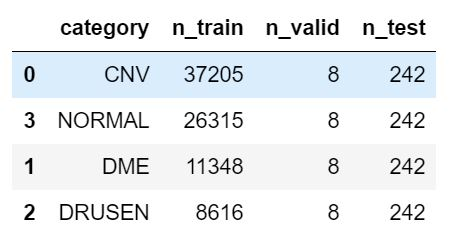
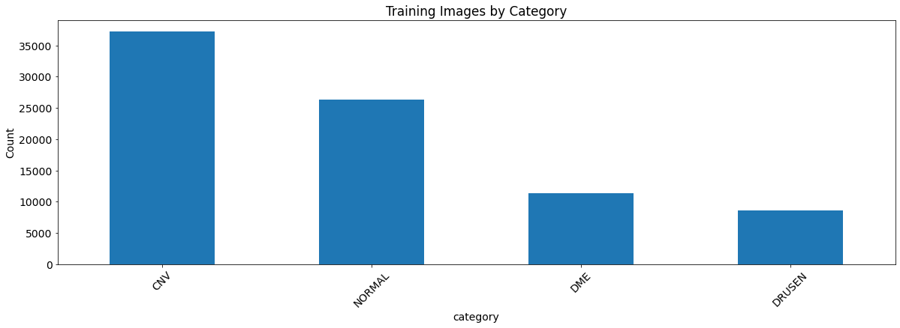
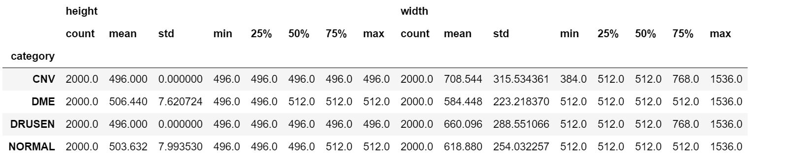
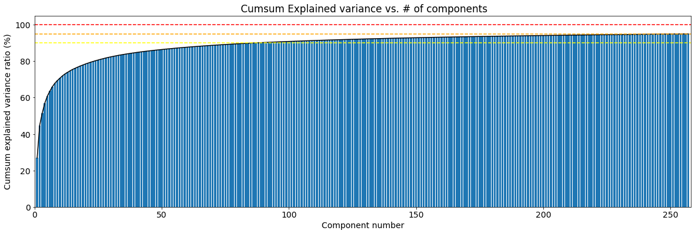
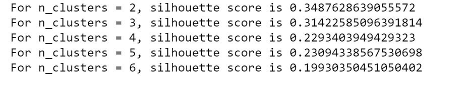
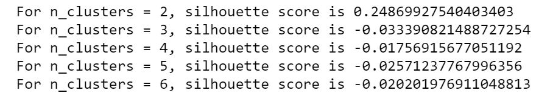

# Unsupervised_image_classification

## Project
I will explore how I can give the computer a group of retine OCT images, and it can cluster the ones with the same patalogy/without any pathology together.

First, I will use a classical clustering algorithm such as K-means.

Secondly, I will use a pretrained convolutional network for feature extraction from OCT images, and then apply a clustering algorithm to the extracted features. 
Also the results will be compared to the true categories of the data set in order to verify whether or not the clusters generated through the clustering algorithms resemble the ground truth categories of the data set.
Many pre-trained models are available such as VGG-16 (2014), Resnet50 (2015), InceptionV3 (2015), and EfficientNet (2019).
For a first approach, I choose to use the last released one - EfficientNet. 

## DATA 

### Context 

Retinal optical coherence tomography (OCT) is an imaging technique used to capture high-resolution cross sections of the retinas of living patients. Approximately 30 million OCT scans are performed each year, and the analysis and interpretation of these images takes up a significant amount of time (Swanson and Fujimoto, 2017).

The figure below Represents Optical Coherence Tomography Images and the Workflow Diagram [Kermany et. al. 2018] http://www.cell.com/cell/fulltext/S0092-8674(18)30154-5

(Far left) choroidal neovascularization (CNV) with neovascular membrane (white arrowheads) and associated subretinal fluid (arrows). (Middle left) Diabetic macular edema (DME) with retinal-thickening-associated intraretinal fluid (arrows). (Middle right) Multiple drusen (arrowheads) present in early AMD. (Far right) Normal retina with preserved foveal contour and absence of any retinal fluid/edema.

**CNV** : Choroidal neovascularization (CNV) involves the growth of new blood vessels that originate from the choroid through a break in the Bruch membrane into the sub–retinal pigment epithelium (sub-RPE) or subretinal space. CNV is a major cause of visual loss. It is a common cause of macular degeneration commonly exacerbated by extreme myopia, malignant myopic degeneration, or age-related developments.
**DME** : Diabetic Macular Edema (DME) is an accumulation of fluid in the macula part of the retina that controls our most detailed vision abilities—due to leaking blood vessels. In order to develop DME, you must first have diabetic retinopathy. Diabetic retinopathy is a disease that damages the blood vessels in the retina, resulting in vision impairment. 
**Drusen**: Drusen are yellow deposits under the retina, made up of lipids and proteins. It likely do not cause AMD but having drusen increases a person’s risk of developing AMD.

Optical coherence tomography (OCT) images (Spectralis OCT, Heidelberg Engineering, Germany) were selected from retrospective cohorts of adult patients from the Shiley Eye Institute of the University of California San Diego, the California Retinal Research Foundation, Medical Center Ophthalmology Associates, the Shanghai First People’s Hospital, and Beijing Tongren Eye Center between July 1, 2013 and March 1, 2017.

### Content
The dataset is organized into 3 folders (train, test, val) and contains subfolders for each image category (NORMAL,CNV,DME,DRUSEN). There are 84,495 X-Ray images (JPEG) and 4 categories (NORMAL,CNV,DME,DRUSEN).

Images are labeled as (disease)-(randomized patient ID)-(image number by this patient) and split into 4 directories: CNV, DME, DRUSEN, and NORMAL.

In this project, I created a smaller datasets consisting of **2000/1000 images from each directories, giving a total of 8000/4000 images.**  

#### Distribution of Images Sizes 
The stats of images sizes by category show that the images have vastly different shapes. 

## K-means clustering algorithm
For K-means the 8000 images data set size has been able to be utilised (no memory issue). 
The algorithm was runned with and without PCA before. 

###  Image pre-processing  : 
Images are reading as grayscale and resizing to 150x150.
The amount of features is reduced  to (8000, 22500)

### PCA
In order to reduce dimentionality PCA is applied. Figure below shows the cumulative sum of the first 257 principal components that explains 95% of the variance (90% --> yellow dashed ligne ; 95% --> orange dashed ligne ; 99% --> red dashed ligne).

This is the number of principal components that will be used when runnig the algorithm.

The result of the preprocessing is a reduction of 22500 features down to 257 principal components.

### Silhouette Score 
No PCA : 

With PCA :

 

Setting n_clusters=2 yielded the best results. Nevertheless, the algorithms achieved low Silhouette index scores, none of the algorithms produce a
clustering that achieves a high Silhouette index score. 

Other clustering technique such as Spectral clustering or GaussianMixture should be testest but the score will be probably still low. 

## Pre-trained EfficientNet model (Google ; 2019)
For this part the 4000 images dataset has utilised because 8000 images dataset leads to memory issue.

The  idea is to use a neural network that has already been trained to detect thousands of classes of images with millions of images. One such dataset is ImageNet that consists of 14 million images.  A ImageNet trained Keras model of EfficientNet is available here : https://keras.io/api/applications/efficientnet/#efficientnetb0-function. 

Then the top dense layers is removed, since it is not supervised classification here, and encoded features from the images are collected.

https://colab.research.google.com/drive/1SxKMN3ACEqsjEsxviI_Nbs3hfQMqdbbv?usp=sharing

## Ressources
 
Data:
https://data.mendeley.com/datasets/rscbjbr9sj/2
http://www.cell.com/cell/fulltext/S0092-8674(18)30154-5

Pre-trained Model:
https://www.analyticsvidhya.com/blog/2020/08/top-4-pre-trained-models-for-image-classification-with-python-code/
https://github.com/beleidy/unsupervised-image-clustering/blob/master/capstone.ipynb

Kmeans :
https://medium.com/datadriveninvestor/k-means-clustering-for-imagery-analysis-56c9976f16b6

